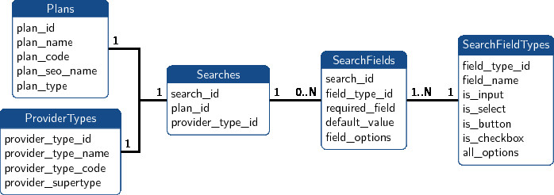
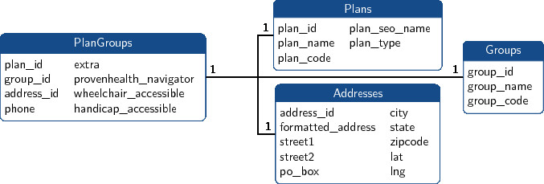
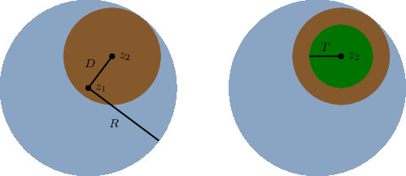
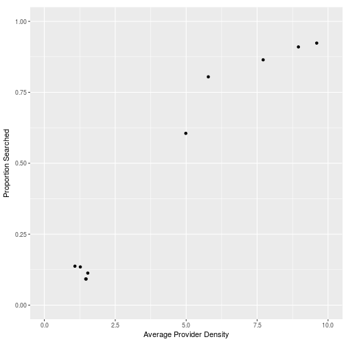

<a name="overview"></a>

The following sections cover the collection of data from Geisinger's <a href="https://www.geisinger.org/health-plan/providersearch/" target="_blank">provider search</a>.

* [Code Arrangement](#code): Data is scraped with Python and makes its way to R.
* [Search Parameters](#databaseparams): All searches post requests to the same URL path with different query strings. The keys for those queries are discussed here.
* [Search Result Tables](#databasesearch): Each search result has a medical group/group practice and an address that will put it on the map.
* [Broken Links](#brokenlinks): Certain groups have broken "(details)" links.
* [Search Overflows](#overflows): Some groups are never found by this search.
* [Zip Code Iteration Algorithm](#zipcodealgorithm): Searches are organized by zip code, and it's possible to cut down the number of zip codes that must be searched.
* [Some Algorithm Analysis](#algorithmanalysis): The algorithm works better when providers are fairly sparse.

This was my introduction to <a href="https://shiny.rstudio.com/" target="_blank">Shiny apps</a> made with <a href="https://www.rstudio.com/" target="_blank">RStudio</a>, and maps with <a href="https://rstudio.github.io/leaflet/" target="_blank">Leaflet for R</a>. It also uses Google's <a href="https://developers.google.com/maps/documentation/geocoding/start" target="_blank">geocoding API</a>. 


### <a name="code"></a>[Code Arrangement](#overview)

Most of the code used is posted on <a href="https://github.com/jimurick/GroupMap" target="_blank">my github</a>. Code for this Shiny app is in the `shiny` directory, and LaTeX code for the 3 TikZ pictures in this document is in the `tex` directory.

The "database" is a directory of files arranged like a relational database. The data is collected with Python into a directory of JSON files, which are converted to CSV for use with R. The JSON data is managed by the following Python programs.

* `parameter_scraper.py` scrapes search parameter information and populates the tables shown in the [Search Parameters](#databaseparams) section
* `group_scraper.py` scrapes search results and populates the tables shown in the [Search Result Tables](#databasesearch) section.
* `geocoder.py` uses Google's geocoding API to find latitude/longitude values for records in the [Addresses](#searchtables) table so that they can be put on the Leaflet map. Note that the file `apikey.txt` is empty; you must obtain an API key and copy it into that file for this to function.
* `util.py` has a few functions to facilitate HTTP requests and database interactions.

In Python, database tables are stored as lists of dictionaries with the same keys, such as the following row from the [Plans](#paramtables) table.


```python
{'plan_id': 0,
 'plan_name': 'Geisinger Choice PPO',
 'plan_type': 'Employer Group Plan',
 'plan_code': 'pgrpnp',
 'plan_seo_name': 'geisinger-choice-ppo'}
```

Each list was saved as a JSON file in the `json/db` directory for use with Python, and converted by `convertDb.R` to a CSV file in the `db` directory for use as data.frames in R. Similarly, JSON search logs are left in `json/logs` and converted to CSV in `logs`.


### <a name="databaseparams"></a>[Search Parameters](#overview)

All provider searches use the url
<a href="https://www.geisinger.org/health-plan/providersearch/search-results/" target="_blank">geisinger.org/health-plan/providersearch/search-results/</a>,
plus a query at the end. A response with appropriate query parameters can have as many as 100 results, spread over 20 pages with 5 providers/page. 

The search url's query part accepts the keys below (plus more that aren't listed).

* Plan and provider type: `HealthCarePlanId`, `HealthCarePlanSeoName`, `ProviderTypeId`
* Geographic: `CityOrZipCode`, `SearchRadius`, `ServicedState`, `ServicedCounties`
* Physician: `PhysicianFirstName`, `PhysicianLastName`, `PhysicianSpecialties`
* Facility: `SiteName`, `Modalities`
* Results Page number: `Page`
* Other: `ProvenHealthNavigator`, `Extra`, `IsPowerSearch`, `IsPrimarySearch`

To get to the search results in a web browser, a user goes through 3 pages, which fill out the necessary search parameters:

1. <a href="https://www.geisinger.org/health-plan/providersearch/" target="_blank">Choose</a> a plan.
2. <a href="https://www.geisinger.org/health-plan/providersearch/pgac62/atlanticare" target="_blank">Choose</a> a provider type. For this project, the type is always "Medical Group or Group Practice".
3. <a href="https://www.geisinger.org/health-plan/providersearch/pgac62/atlanticare/21/medical-group-or-group-practice" target="_blank">Enter values</a> for specific query parameters, such as `CityOrZipCode`/`SearchRadius`.

Scraping data from all possible choices of plan and provider type populates the tables below. 

<br><center><a name="paramtables"></a></center><br>

Each row in the Searches table is determined by exactly one choice of a plan and a provider type, and has some number of search fields, which may or may not be made visible by the web browser. It's possible for a search to have no search fields; this happens whenever <a href="https://www.geisinger.org/health-plan/providersearch/pgac62/atlanticare/1000/behavioral-health" target="_blank">Behavioral Health</a> is the provider type. 

The search query parameters listed earlier, with the exception of `Page`, correspond directly to the 16 records in the SearchFieldTypes table. `parameter_scraper.py` also saves the set of options in cases like `PhysicianSpecialty` and `Modality` where the value is selected from a combobox.


### <a name="databasesearch"></a>[Search Result Tables](#overview)

Since we're only searching Medical Groups and Group Practices, most search parameters listed in the previous section can be filled out.

* `PhysicianFirstName`, `PhysicianLastName`, `PhysicianSpecialties`, `SiteName`, `Modalities`, `ServicedState`, `ServicedCounties`, `ProvenHealthNavigator`, `Extra` are blank or absent
* `ProviderTypeId` is always 21 (Medical Groups and Group Practices)
* `IsPowerSearch` is always "False" and `IsPrimarySearch` is always "True"
* `SearchRadius` is always 100 (miles)

That leaves

* `HealthCarePlanId`/`HealthCarePlanSeoName` which are determined by the 26 plans, and
* `CityOrZipCode` which has many possible values.

For a fixed plan choice, an algorithm [described later](#zipcodealgorithm) manages a queue of zip codes to search, which should result in [almost](#overflows) all providers turning up as results in some search. Results, such as in <a href="https://www.geisinger.org/health-plan/providersearch/search-results/?CityOrZipCode=17821&SearchRadius=100&SiteName=&IsPowerSearch=False&IsPrimarySearch=True&HealthCarePlanId=PGAC62&HealthCarePlanSeoName=atlanticare&ProviderTypeId=21" target="_blank">this search</a>, are collected by the Python program `searcher.py` into the following tables. 

<br><center><a name="searchtables"></a></center><br>

Each distinct result is stored as a PlanGroups record, where two results are considered distinct if at least one of `plan_id`, `group_id` or `address_id` differ.

The search results all have a <a href="https://www.geisinger.org/health-plan/providersearch/provider-details/21/108397/pgac62/108397" target="_blank">(details)</a> link that encode some important information: the last three steps of the path are `group_code/plan_code/group_code`. The `group_code` field is unique for Groups and is used to determine whether a given search result has a new group. The [next section](#brokenlinks) shows some problems that can be identified by `group_code`.

The Addresses table's fields `lat`, `lng` and `formatted_address` are filled out with the Python program `geocoder.py`.


### <a name="brokenlinks"></a>[Broken Links](#overview)

Groups whose `group_code` has a period have broken "(details)" links. A complete list of such groups found in this search is below, along with links to searches demonstrating the problem.

<center>

Group Code&nbsp;&nbsp;&nbsp;&nbsp; | Group Name
---|---
fampracctr.miff|<a href="https://www.geisinger.org/health-plan/providersearch/search-results/?CityOrZipCode=17844&SearchRadius=100&SiteName=Family Practice Center, PC - Mifflinburg&HealthCarePlanId=pgrpnp&HealthCarePlanSeoName=geisinger-choice-ppo&IsPowerSearch=False&IsPrimarySearch=True&ProviderTypeId=21" target="_blank">Family Practice Center, PC - Mifflinburg</a>
gmg-mt. pocono|<a href="https://www.geisinger.org/health-plan/providersearch/search-results/?CityOrZipCode=18344&SearchRadius=100&SiteName=Geisinger Clinic - Mt Pocono&HealthCarePlanId=pgrpnp&HealthCarePlanSeoName=geisinger-choice-ppo&IsPowerSearch=False&IsPrimarySearch=True&ProviderTypeId=21" target="_blank">Geisinger Clinic - Mt Pocono</a>
gmc-crit. care|<a href="https://www.geisinger.org/health-plan/providersearch/search-results/?CityOrZipCode=17822&SearchRadius=100&SiteName=GMC Critical Care Medicine&HealthCarePlanId=pgac62&HealthCarePlanSeoName=atlanticare&IsPowerSearch=False&IsPrimarySearch=True&ProviderTypeId=21" target="_blank">GMC Critical Care Medicine</a>
gmc-infec. dis|<a href="https://www.geisinger.org/health-plan/providersearch/search-results/?CityOrZipCode=17822&SearchRadius=100&SiteName=GMC Infectious Diseases&HealthCarePlanId=pgac62&HealthCarePlanSeoName=atlanticare&IsPowerSearch=False&IsPrimarySearch=True&ProviderTypeId=21" target="_blank">GMC Infectious Diseases</a>
st. l360 w|<a href="https://www.geisinger.org/health-plan/providersearch/search-results/?CityOrZipCode=18218&SearchRadius=100&SiteName=St. Luke's Miner's Memorial Hospital&HealthCarePlanId=pgac62&HealthCarePlanSeoName=atlanticare&IsPowerSearch=False&IsPrimarySearch=True&ProviderTypeId=21" target="_blank">St. Luke's Miner's Memorial Hospital</a>
uphs-ccaj. edwin wood clinicpcp&nbsp;&nbsp;&nbsp;|<a href="https://www.geisinger.org/health-plan/providersearch/search-results/?CityOrZipCode=19106&SearchRadius=100&SiteName=UPHS-CCA-J. Edwin Wood Clinic-PCP&HealthCarePlanId=pgac62&HealthCarePlanSeoName=atlanticare&IsPowerSearch=False&IsPrimarySearch=True&ProviderTypeId=21" target="_blank">UPHS-CCA-J. Edwin Wood Clinic-PCP</a>
rad. med. assoc|<a href="https://www.geisinger.org/health-plan/providersearch/search-results/?CityOrZipCode=18510&SearchRadius=100&SiteName=Northeast Radiation Oncology Center&HealthCarePlanId=pgac62&HealthCarePlanSeoName=atlanticare&IsPowerSearch=False&IsPrimarySearch=True&ProviderTypeId=21" target="_blank">Northeast Radiation Oncology Center</a>
retocu-st. col|<a href="https://www.geisinger.org/health-plan/providersearch/search-results/?CityOrZipCode=16803&SearchRadius=100&SiteName=Pennsylvania Retina Specialists PC&HealthCarePlanId=pgac62&HealthCarePlanSeoName=atlanticare&IsPowerSearch=False&IsPrimarySearch=True&ProviderTypeId=21" target="_blank">Pennsylvania Retina Specialists PC</a>
rbpa_w.reading|<a href="https://www.geisinger.org/health-plan/providersearch/search-results/?CityOrZipCode=19611&SearchRadius=100&SiteName=All About Children Pediatric Partners&HealthCarePlanId=pgac62&HealthCarePlanSeoName=atlanticare&IsPowerSearch=False&IsPrimarySearch=True&ProviderTypeId=21" target="_blank">All About Children Pediatric Partners</a>

</center>

On the map, these links have "(link broken)" in the marker's popup link, and they link to search results instead of the group's details page.


### <a name="overflows"></a>[Search Overflows](#overview)

There were 10 zipcodes where, for at least one plan, all 100 search results were from that zipcode. Results are returned by distance (0.0 miles for all 100 in this case) and then alphabetically, so groups toward the end of the alphabet may never appear in this automated search. The zip codes and specific pages demonstrating the overflows are linked to below.

<center>

&nbsp;&nbsp;Zip Code&nbsp;&nbsp; | City | &nbsp;&nbsp;AtlantiCare&nbsp;&nbsp; | &nbsp;&nbsp;Christiana&nbsp;&nbsp; | &nbsp;&nbsp;EMHS&nbsp;&nbsp;
:-:|---|:-:|:-:|:-:
17403|York, PA|<a href="https://www.geisinger.org/health-plan/providersearch/search-results/?CityOrZipCode=17403&SearchRadius=100&SiteName=&IsPowerSearch=False&IsPrimarySearch=True&HealthCarePlanId=PGAC62&HealthCarePlanSeoName=atlanticare&ProviderTypeId=21&Page=20" target="_blank">link</a>|<a href="https://www.geisinger.org/health-plan/providersearch/search-results/?CityOrZipCode=17403&SearchRadius=100&SiteName=&IsPowerSearch=False&IsPrimarySearch=True&HealthCarePlanId=PGDE81&HealthCarePlanSeoName=christiana-care-health-system-employee-plan&ProviderTypeId=21&Page=20" target="_blank">link</a>|
17601|Lancaster, PA|<a href="https://www.geisinger.org/health-plan/providersearch/search-results/?CityOrZipCode=17601&SearchRadius=100&SiteName=&IsPowerSearch=False&IsPrimarySearch=True&HealthCarePlanId=PGAC62&HealthCarePlanSeoName=atlanticare&ProviderTypeId=21&Page=20" target="_blank">link</a>|<a href="https://www.geisinger.org/health-plan/providersearch/search-results/?CityOrZipCode=17601&SearchRadius=100&SiteName=&IsPowerSearch=False&IsPrimarySearch=True&HealthCarePlanId=PGDE81&HealthCarePlanSeoName=christiana-care-health-system-employee-plan&ProviderTypeId=21&Page=20" target="_blank">link</a>|<a href="https://www.geisinger.org/health-plan/providersearch/search-results/?CityOrZipCode=17601&SearchRadius=100&SiteName=&IsPowerSearch=False&IsPrimarySearch=True&HealthCarePlanId=PGEM65&HealthCarePlanSeoName=emhs-employee-plan&ProviderTypeId=21&Page=20" target="_blank">link</a>
18017|Bethlehem, PA|<a href="https://www.geisinger.org/health-plan/providersearch/search-results/?CityOrZipCode=18017&SearchRadius=100&SiteName=&IsPowerSearch=False&IsPrimarySearch=True&HealthCarePlanId=PGAC62&HealthCarePlanSeoName=atlanticare&ProviderTypeId=21&Page=20" target="_blank">link</a>|<a href="https://www.geisinger.org/health-plan/providersearch/search-results/?CityOrZipCode=18017&SearchRadius=100&SiteName=&IsPowerSearch=False&IsPrimarySearch=True&HealthCarePlanId=PGDE81&HealthCarePlanSeoName=christiana-care-health-system-employee-plan&ProviderTypeId=21&Page=20" target="_blank">link</a>|
18103|Allentown, PA||<a href="https://www.geisinger.org/health-plan/providersearch/search-results/?CityOrZipCode=18103&SearchRadius=100&SiteName=&IsPowerSearch=False&IsPrimarySearch=True&HealthCarePlanId=PGDE81&HealthCarePlanSeoName=christiana-care-health-system-employee-plan&ProviderTypeId=21&Page=20" target="_blank">link</a>|
18104|Allentown, PA|<a href="https://www.geisinger.org/health-plan/providersearch/search-results/?CityOrZipCode=18104&SearchRadius=100&SiteName=&IsPowerSearch=False&IsPrimarySearch=True&HealthCarePlanId=PGAC62&HealthCarePlanSeoName=atlanticare&ProviderTypeId=21&Page=20" target="_blank">link</a>|<a href="https://www.geisinger.org/health-plan/providersearch/search-results/?CityOrZipCode=18104&SearchRadius=100&SiteName=&IsPowerSearch=False&IsPrimarySearch=True&HealthCarePlanId=PGDE81&HealthCarePlanSeoName=christiana-care-health-system-employee-plan&ProviderTypeId=21&Page=20" target="_blank">link</a>|<a href="https://www.geisinger.org/health-plan/providersearch/search-results/?CityOrZipCode=18104&SearchRadius=100&SiteName=&IsPowerSearch=False&IsPrimarySearch=True&HealthCarePlanId=PGEM65&HealthCarePlanSeoName=emhs-employee-plan&ProviderTypeId=21&Page=20" target="_blank">link</a>
18702|Wilkes-Barre, PA|<a href="https://www.geisinger.org/health-plan/providersearch/search-results/?CityOrZipCode=18702&SearchRadius=100&SiteName=&IsPowerSearch=False&IsPrimarySearch=True&HealthCarePlanId=PGAC62&HealthCarePlanSeoName=atlanticare&ProviderTypeId=21&Page=20" target="_blank">link</a>|<a href="https://www.geisinger.org/health-plan/providersearch/search-results/?CityOrZipCode=18702&SearchRadius=100&SiteName=&IsPowerSearch=False&IsPrimarySearch=True&HealthCarePlanId=PGDE81&HealthCarePlanSeoName=christiana-care-health-system-employee-plan&ProviderTypeId=21&Page=20" target="_blank">link</a>|
19104|Philadelphia, PA|<a href="https://www.geisinger.org/health-plan/providersearch/search-results/?CityOrZipCode=19104&SearchRadius=100&SiteName=&IsPowerSearch=False&IsPrimarySearch=True&HealthCarePlanId=PGAC62&HealthCarePlanSeoName=atlanticare&ProviderTypeId=21&Page=20" target="_blank">link</a>|<a href="https://www.geisinger.org/health-plan/providersearch/search-results/?CityOrZipCode=19104&SearchRadius=100&SiteName=&IsPowerSearch=False&IsPrimarySearch=True&HealthCarePlanId=PGDE81&HealthCarePlanSeoName=christiana-care-health-system-employee-plan&ProviderTypeId=21&Page=20" target="_blank">link</a>|<a href="https://www.geisinger.org/health-plan/providersearch/search-results/?CityOrZipCode=19104&SearchRadius=100&SiteName=&IsPowerSearch=False&IsPrimarySearch=True&HealthCarePlanId=PGEM65&HealthCarePlanSeoName=emhs-employee-plan&ProviderTypeId=21&Page=20" target="_blank">link</a>
19107|Philadelphia, PA|<a href="https://www.geisinger.org/health-plan/providersearch/search-results/?CityOrZipCode=19107&SearchRadius=100&SiteName=&IsPowerSearch=False&IsPrimarySearch=True&HealthCarePlanId=PGAC62&HealthCarePlanSeoName=atlanticare&ProviderTypeId=21&Page=20" target="_blank">link</a>|<a href="https://www.geisinger.org/health-plan/providersearch/search-results/?CityOrZipCode=19107&SearchRadius=100&SiteName=&IsPowerSearch=False&IsPrimarySearch=True&HealthCarePlanId=PGDE81&HealthCarePlanSeoName=christiana-care-health-system-employee-plan&ProviderTypeId=21&Page=20" target="_blank">link</a>|
19713|Newark, DE||<a href="https://www.geisinger.org/health-plan/providersearch/search-results/?CityOrZipCode=19713&SearchRadius=100&SiteName=&IsPowerSearch=False&IsPrimarySearch=True&HealthCarePlanId=PGDE81&HealthCarePlanSeoName=christiana-care-health-system-employee-plan&ProviderTypeId=21&Page=20" target="_blank">link</a>|
21287|Baltimore, MD|<a href="https://www.geisinger.org/health-plan/providersearch/search-results/?CityOrZipCode=21287&SearchRadius=100&SiteName=&IsPowerSearch=False&IsPrimarySearch=True&HealthCarePlanId=PGAC62&HealthCarePlanSeoName=atlanticare&ProviderTypeId=21&Page=20" target="_blank">link</a>|<a href="https://www.geisinger.org/health-plan/providersearch/search-results/?CityOrZipCode=21287&SearchRadius=100&SiteName=&IsPowerSearch=False&IsPrimarySearch=True&HealthCarePlanId=PGDE81&HealthCarePlanSeoName=christiana-care-health-system-employee-plan&ProviderTypeId=21&Page=20" target="_blank">link</a>|<a href="https://www.geisinger.org/health-plan/providersearch/search-results/?CityOrZipCode=21287&SearchRadius=100&SiteName=&IsPowerSearch=False&IsPrimarySearch=True&HealthCarePlanId=PGEM65&HealthCarePlanSeoName=emhs-employee-plan&ProviderTypeId=21&Page=20" target="_blank">link</a>

</center>

Groups that would appear as results numbered 101 and up in those searches are missing from the map.


### <a name="zipcodealgorithm"></a>[Zip Code Iteration Algorithm](#overview)

The basic initial idea of the algorithm is to start with 17821 in Danville and 08401 in Atlantic City, and maintain a *queue* of zipcodes to search and a *set* of searched zip codes. Every time a zip code is popped off the queue and searched, it's added to the used set and the search results introduce new zip codes to add to the queue, provided that they aren't already in the queue or the used set. Continue until the queue is empty.

To avoid searching every zipcode that appears in the algorithm just described, we can use the "distance" field that appears in each result to "toss" certain zip codes into the used set without searching them. The next few paragraphs introduce a quantity we'll call the **toss radius** associated with each zip code in the queue.

The toss radius motivation is to avoid triple-counting. Suppose that when searching providers in zip code $z_1$, there is a result in zip code $z_2$ which is $D$ miles from $z_1$. Let $R$ be the maximum distance from zip code $z_1$ to any search result (equivalently, $R$ is the distance to the last search result). The situation is draw on the left:

<br><center></center><br>

If zip code $z_2$ will be searched later, results within $R-D$ miles of $z_2$ (in the brown circle) will most likely be repeated. Define the toss radius to be $T=R-D-c$, where $c>0$ is a fixed constant subtracted to account for the variability in the zip code territory shapes. In `group_scraper.py`, $c$ is 15 miles. The toss radius determines the green circle in the figure above.

If zip code $z_2$ is searched for providers, and if all results with zip code $z_3$ are within $T$ miles of $z_2$, then we will consider $z_3$ to be close enough to $z_1$ and $z_2$ that its search is unlikely to contribute new zip codes that wouldn't otherwise be encountered. For that reason, $z_3$ will be "tossed" into the used set when $z_2$ is searched.

Now we can give Python-like pseudocode for the algorithm. Suppose an arbitrary plan was chosen and let `U` be the set of used zip codes and let `Q` be a queue of [zip code, toss radius] pairs. The object `distances` below is like a Python dict with zip codes as keys.

* `U` = set()
* `Q` = [ [17821, 0.0], [08401, 0.0] ]
* while `Q` is not empty
    * z, T = `Q`.pop()
    * `U`.add(z)
    * results = searchZipCode(z)
    * R = results[-1].distance
    * `distances` = {}
    * for r in results
        * if r.zipcode in `distances`.keys()
            * `distances`[r.zipcode] = max(r.distance, `distances`[r.zipcode])
        * else
            * `distances`[r.zipcode] = r.distance
    * for z2 in keyListSortedDescendingByValue(`distances`)
        * T2 = R - `distances`[z2] - c
        * if `distances`[z2] < T
            * `U`.add(z2)
        * else if z2 in `Q`
            * j = z2's index in `Q`
            * `Q`[j].tossradius = max(T2, `Q`[j].tossradius)
        * else if z2 not in `U`
            * `Q`.append([z2, T2])

This algorithm was tested with Geisinger Choice PPO against the algorithm searching all zipcodes, as described at the beginning of this section, and got the exact same results, but with 7 searches instead of 77.


### <a name="algorithmanalysis"></a>[Some Algorithm Analysis](#overview)

Most of the time taken by this algorithm is in waiting for HTTP responses, so the best way to measure how much it improves performance is with the percentage of searches it avoids. As the following table shows, the ratio of the numbers of zip codes searched over the total number found for each plan was between about 10 and 90%.


```
##                                             Plan Searches Zipcodes
## 1                           Geisinger Choice PPO        7       76
## 2                       Geisinger Health Options        7       76
## 3                          Geisinger Health Plan        7       76
## 4          Geisinger Health System Employee Plan        7       76
## 5  Geisinger Marketplace HMO, POS & Catastrophic        7       76
## 6                      Geisinger Marketplace PPO        7       76
## 7               Geisinger Marketplace PPO Select        7       52
## 8                        Geisinger Smart Options        7       76
## 9                     Aon Active Health Exchange        7       76
## 10                                   AtlantiCare      829      911
## 11   Christiana Care Health System Employee Plan      869      941
## 12                            EMHS Employee Plan      702      812
## 13                        Family Practice Center        7       76
## 14                     Holy Spirit Employee Plan        7       76
## 15             PEBTF Custom HMO, REHP Custom HMO        7       62
## 16          St. Luke's University Health Network       89      147
## 17             UFCW 1776 H & W Fund - Wise Foods        7       51
## 18                          Geisinger Choice PPO        7       76
## 19   Geisinger Health Plan Solutions (Non Group)        7       76
## 20 Geisinger Marketplace HMO, POS & Catastrophic        7       76
## 21                     Geisinger Marketplace PPO        7       76
## 22                                    GHP Family      387      481
## 23                               GHP Kids (CHIP)        7       76
## 24                  Geisinger Gold Classic (HMO)        7       76
## 25                Geisinger Gold Preferred (PPO)        7       76
## 26               Geisinger Gold Secure (HMO SNP)        7       76
```

The table Totals keeps some overall statistics by `plan_id`. Below are rows corresponding to Aon, AtlantiCare and Christiana, respectively.


```r
Totals[9:11,]
```

```
##    searches overflows plan_id zipcodes groups
## 9         7         0       8       76    112
## 10      829         7       9      911   8159
## 11      869        10      10      941   9034
```

The following scatter plot indicates that there is a relationship between the average "density" of a plan's providers by zipcode and the performance of the algorithm, measured by the percentage of zipcodes with providers that were searched.


```r
Efficiency <- Totals %>% transmute(density=(groups/zipcodes),
                                   searched=(searches/zipcodes)) %>%
              distinct(density, searched)
ggplot2::ggplot(Efficiency, aes(density, searched)) + 
  geom_point() + scale_size_area() + 
  xlim(0,10) + ylim(0,1) + coord_equal(ratio=10) +
  xlab("Average Provider Density") + ylab("Proportion Searched")
```



In particular, the algorithm performs considerably better when providers are sparse.
